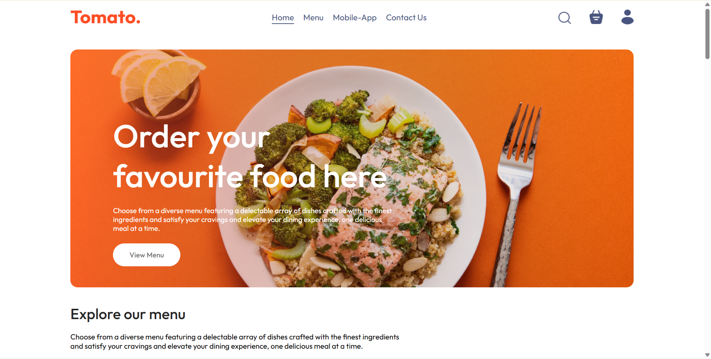
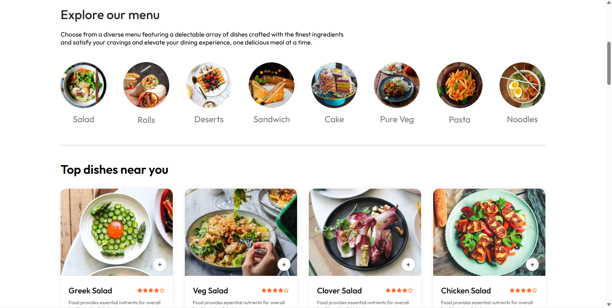
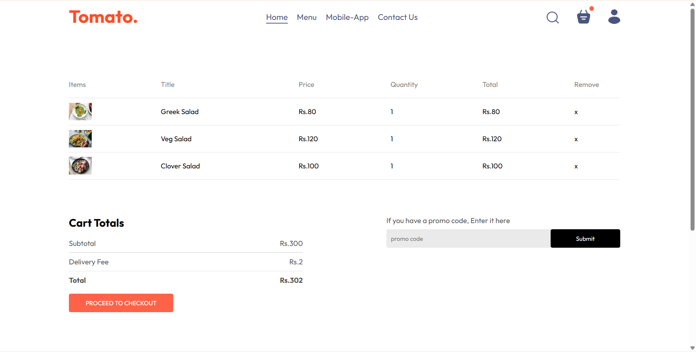

# 🍽️ TOMATO

Modern Food Ordering Web Application 🚀🔥


## 🚀 About the Project
Tomato is a full-stack food ordering platform designed to offer a smooth, fast, and user-friendly food ordering experience.   
Users can browse dishes, manage their cart, place orders, and enjoy a seamless checkout with a simulated payment flow.

The platform includes:  
⚛️ React + Vite (Frontend)  
🌐 Node.js + Express (Backend)  
🍃 MongoDB + Mongoose (Database)  
🔐 JWT Authentication  
🛒 Real-time Cart Updates  
📦 Order Management + Tracking


## ✨ Features

### 🔐 User Authentication

- User Signup/Login
- JWT Token-based Authentication
- Auto login persistence through local storage

### 🛒 Smart Cart System

- Add / Remove items instantly
- Dynamic price updates
- Cart stored in MongoDB for logged-in users

### 🧾 Place Orders Seamlessly

- Delivery details form
- Backend order storage
- Simulated payment (No real gateway required)
- Cart auto-clears after ordering

### 🍱 Browse Food Items

- Explore menu categories
- Responsive grid layout
- Fast loading images
- Clean and modern UI

### ⚡ Smooth User Experience

- Toast notifications
- Mobile responsive
- Fast performance with Vite

## 🛠️ Tech Stack

* Client: React, Vite, Axios, CSS3, React Router, Toastify  
* Server: Node.js, Express.js, MongoDB, Mongoose, JWT  
* Tools:  MongoDB Atlas, Git, VS Code

## 📦 Folder Structure

```
FOOD-DEL/
│
├── frontend/                     # User Frontend (React)
│   ├── public/
│   └── src/
│       ├── components/
│       ├── pages/
│       ├── context/
│       ├── assets/
│       └── App.jsx
│
├── admin/                      # Admin Dashboard (React)
│   ├── public/
│   └── src/
│       ├── components/
│       ├── pages/
│       ├── assets/
│       └── App.jsx
│
└── server/                     # Backend (Node.js)
    ├── controllers/
    ├── routes/
    ├── models/
    ├── middleware/
    ├── config/
    └── server.js
```
## ⚙️Environment Variables

To run this project, you will need to add the following environment variables to your .env file

* `JWT_SECRET:randomsecret`

## ▶️ Run the Project

### 1️⃣ Clone the Repository
```bash
  git clone https://github.com/Danishmanyotra/Tomato
```
### 2️⃣ Backend Setup

```bash
cd server
npm install
npm run dev
```
### 3️⃣ Frontend Setup

```bash
cd client
npm install
npm run dev
```
### 🍽️ Demo
- Go through this link:- https://tomato-frontend-zcwv.onrender.com
- You can create your own account as well.
- After that search for the food which you loved most.
- Go Add to cart & place the order 
- Enjoy the meal.

  ## 🖼️ App Preview 

Below is a quick preview of the Tomato UI:
- User UI
<p align="center">  
  
  
   
    
</p>

- Admin UI
<p align = "center">
      
   
   
</p>

## ⭐ Feedback

If you like this project, don’t forget to ⭐ star the repository.

Your support motivates me to build more amazing full-stack applications! 🚀💙
